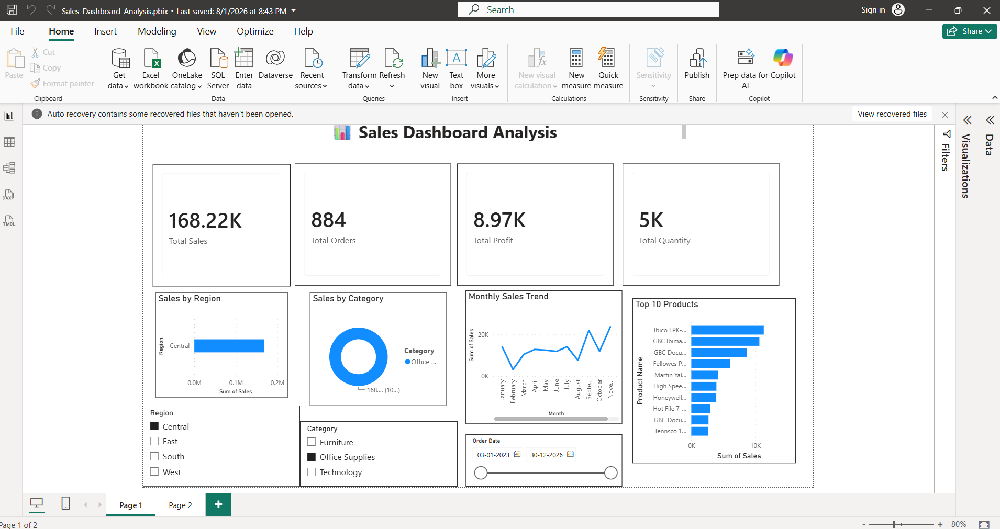

# 📊 Sales Dashboard Analysis

## 📌 Project Overview

This project analyzes sales data using Microsoft Power BI to understand sales performance across different regions, product categories, time periods, and products.

## 🛠️ Tools Used

- Power BI
- Power Query
- DAX
- Data Visualization

## 📈 Dashboard Features

- Total Sales KPI
- Total Orders KPI
- Total Profit KPI
- Total Quantity KPI
- Sales by Region
- Sales by Category
- Monthly Sales Trend
- Top 10 Products
- Region filter
- Category filter
- Order Date filter

## 🎯 Key Performance Indicators

| KPI | Value |
|---|---:|
| Total Sales | 2.33M |
| Total Orders | 5K |
| Total Profit | 292.30K |
| Total Quantity | 39K |

## 💡 Key Insights

- The **West region** generated the highest sales.
- **Technology** was the highest-selling product category.
- Sales varied across months, with a noticeable increase during September.
- A small group of products contributed significantly to overall sales.
- Interactive filters allow users to analyze sales based on region, category, and date.

## 📷 Dashboard Preview

## 📁 Project Files

- `Sales_Dashboard_Analysis.pbix` – Power BI dashboard file
- `Dashboard_Screenshot.png` – Dashboard preview

## 🎯 Objective

The objective of this project is to understand how raw sales data can be transformed into interactive visual insights that support business decision-making.
